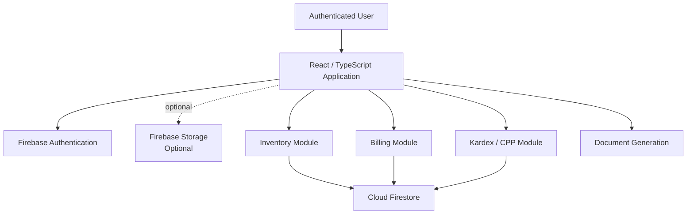

# CPP Management Template

Reusable inventory and billing template built with **React, TypeScript, Vite and Firebase**, centered on **CPP (Costo Promedio Ponderado / Weighted Average Cost)** inventory valuation.

The project is designed as a configurable starting point for inventory-based business systems that need product management, stock movements, billing records, Kardex history and weighted-average inventory costing.

> **Template scope**
>
> This repository is a reusable technical template. Business-specific implementations, credentials, branding and production data are maintained separately.

---

## Overview

CPP Management Template provides a modular foundation for inventory and billing systems where product cost must be recalculated using the **weighted average cost method** after stock entries.

The template combines:

- Product inventory
- Stock entries
- Stock exits
- Billing records
- Kardex history
- Weighted average cost calculations
- Firebase Authentication
- Cloud Firestore persistence
- Optional Firebase Storage integration
- PDF generation
- Protected application routes
- Reusable business modules

The objective is to keep a common technical core that can be adapted to different organizations without rebuilding the entire application.

---

## Core Inventory Model

The central inventory concept is **CPP — Costo Promedio Ponderado**, equivalent to **Weighted Average Cost**.

When new stock enters inventory at a different unit cost, the average unit cost is recalculated using the existing inventory value and the value of the new entry.

A simplified formula is:

```text
New Average Cost =
(Current Stock × Current Average Cost + Incoming Stock × Incoming Unit Cost)
---------------------------------------------------------------------------
                    Current Stock + Incoming Stock
```

Example:

```text
Current stock:          10 units
Current average cost:   Bs 20
Incoming stock:          5 units
Incoming unit cost:     Bs 26

Current value:          Bs 200
Incoming value:         Bs 130
Total value:            Bs 330
Total stock:            15 units

New average cost:       Bs 22
```

This value becomes the reference cost for subsequent inventory movements until another entry changes the weighted average.

---

## Main Features

### Inventory Management

The inventory module provides a structured view of products and their current stock state.

Typical product information can include:

- Product name
- Current stock
- Current weighted average cost
- Inventory value
- Additional business-specific fields

---

### Stock Entries

Inventory entries increase available stock and can trigger a new CPP calculation.

```text
Existing inventory
        +
New entry
        ↓
Recalculate weighted average cost
        ↓
Update stock
        ↓
Register Kardex movement
```

---

### Stock Exits

Stock exits reduce available inventory and register the corresponding movement.

Depending on the final implementation, exits may originate from:

- Billing
- Sales
- Internal consumption
- Adjustments
- Other business operations

The template is designed so these workflows can be customized without changing the overall inventory model.

---

### Kardex

Each product can expose a movement history through its Kardex.

A Kardex can include:

- Date
- Movement type
- Quantity
- Entry value
- Exit value
- Current stock
- Weighted average cost
- Balance

This provides traceability for inventory changes over time.

---

### Billing

The billing module supports records containing multiple products.

Typical workflow:

```text
Select products
      ↓
Validate quantities
      ↓
Create billing record
      ↓
Register stock exits
      ↓
Update inventory
      ↓
Generate document / PDF
```

Billing logic can be adapted to the fiscal and operational requirements of each implementation.

---

### PDF Generation

The project supports document-export workflows for elements such as:

- Invoices
- Kardex reports
- Inventory documents

PDF generation can be implemented through the module configured in each implementation, such as `jsPDF` on the client or another document-generation service when required.

---

## Technology Stack

### Frontend

- React
- TypeScript
- Vite
- React Router DOM

### Cloud

- Firebase Authentication
- Cloud Firestore
- Firebase Storage *(optional, depending on implementation)*

### Documents

- PDF generation modules such as jsPDF
- Alternative server-side generation can be integrated when required

### Styling

- CSS
- Tailwind CSS where applicable

---

## Architecture



The application separates user-facing modules from Firebase persistence and authentication services.

---

## Main Data Collections

Typical Firestore collections include:

```text
productos
facturas
entradas
salidas
```

### `productos`

Stores inventory-related product information.

Typical fields may include:

- Current stock
- Current CPP
- Product metadata
- Additional configuration fields

### `entradas`

Registers stock-entry movements.

### `salidas`

Registers stock-exit movements.

### `facturas`

Stores billing documents containing one or more products.

The final data model should be adapted to each implementation's business rules.

---

## Firestore Indexes

Firestore automatically creates simple indexes for individual fields.

Queries combining multiple filters or ordering conditions may require composite indexes.

Example:

```json
{
  "indexes": [
    {
      "collectionGroup": "facturas",
      "queryScope": "COLLECTION",
      "fields": [
        {
          "fieldPath": "status",
          "order": "ASCENDING"
        },
        {
          "fieldPath": "createdAt",
          "order": "DESCENDING"
        }
      ]
    }
  ]
}
```

Indexes can be:

- Created manually from Firebase Console
- Created from the link provided by Firestore when a query requires one
- Versioned through `firestore.indexes.json`
- Deployed with Firebase CLI

Versioning indexes is recommended for reproducible deployments.

---

## Authentication

The template uses Firebase Authentication with Email/Password.

A new implementation should:

1. Create its own Firebase project.
2. Enable **Email/Password** authentication.
3. Configure authorized domains.
4. Create or register the required users.
5. Define authorization rules appropriate to the business.

Authentication should not be treated as equivalent to authorization.

Sensitive administrative operations should also be protected through application roles and Firestore security rules.

---

## Environment Configuration

Create a local environment file based on the project configuration.

Example:

```env
VITE_FIREBASE_API_KEY=your-web-api-key
VITE_FIREBASE_AUTH_DOMAIN=your-project.firebaseapp.com
VITE_FIREBASE_PROJECT_ID=your-project-id
VITE_FIREBASE_STORAGE_BUCKET=your-project.appspot.com
VITE_FIREBASE_MESSAGING_SENDER_ID=your-sender-id
VITE_FIREBASE_APP_ID=your-app-id
VITE_FIREBASE_MEASUREMENT_ID=your-measurement-id
```

Firebase web configuration values are used by the client application.

However:

- Do not commit environment-specific configuration unnecessarily.
- Never expose service-account credentials or private server secrets in `VITE_*` variables.
- Configure Firebase security rules independently from client configuration.
- Apply appropriate API-key restrictions in Google Cloud when required.

Changes to environment variables require restarting the development server.

---

## Getting Started

Clone or create a new repository using **Use this template**.

Install dependencies:

```bash
npm install
```

Create the corresponding environment configuration.

Start the development server:

```bash
npm run dev
```

Create a production build:

```bash
npm run build
```

---

## Main Application Modules

Typical application areas include:

### Login

Authentication through Firebase Auth.

### Inventory

Product listing and current stock information.

Each product can expose its Kardex and CPP history.

### Entries

Registers stock received into inventory.

### Exits

Registers inventory outflows.

### Billing

Creates and lists billing records containing multiple products.

### Kardex

Displays inventory movements and the evolution of weighted average cost.

### Documents

Exports invoices, Kardex records or other commercial documents to PDF.

---

## Typical Inventory Flow

```text
Product
   ↓
Initial Stock
   ↓
Inventory Entry
   ↓
CPP Recalculation
   ↓
Current Inventory
   ↓
Inventory Exit / Billing
   ↓
Kardex Movement
```

The exact business rules can be extended for each implementation.

---

## Recommended Data Integrity Rules

Inventory systems should avoid relying only on values calculated in the browser.

For production implementations, review operations that modify:

- Stock
- CPP
- Inventory value
- Invoice totals
- Movement history

Where possible, related inventory mutations should be performed atomically.

Firestore transactions or another trusted application layer can be used to reduce inconsistencies caused by concurrent updates.

---

## Customization

A new implementation will typically customize:

- Business name
- Brand identity
- Product fields
- Categories
- Tax calculations
- Billing format
- Document templates
- Inventory rules
- Firebase project
- Authentication rules
- User roles
- Firestore security rules
- Visual theme
- Reports

The core inventory concepts should remain independent from client-specific branding whenever possible.

---

## Template Workflow

This repository is configured as a GitHub **Template Repository**.

Recommended workflow:

```text
CPP-Management-Template
        ↓
Use this template
        ↓
New implementation
        ↓
Own Firebase project
        ↓
Business configuration
        ↓
Custom branding
        ↓
Additional modules
```

Each generated implementation should use its own:

- Firebase project
- Environment configuration
- Authentication users
- Firestore rules
- Firestore indexes
- Business data
- Branding
- Production credentials

---

## Security Notes

Before using the template in production:

- Use a dedicated Firebase project
- Review Firestore security rules
- Restrict sensitive operations
- Protect administrative routes
- Do not expose service-account credentials
- Validate all inventory mutations
- Review concurrent stock operations
- Validate invoice calculations
- Review document-generation inputs
- Configure authorized authentication domains
- Apply appropriate Google Cloud API restrictions
- Review backups and data-retention requirements

---

## Future Improvements

Potential improvements for the template include:

- More isolated CPP calculation engine
- Expanded unit tests for costing logic
- Firestore transaction hardening
- Role-based access control
- More complete inventory reports
- Supplier management
- Customer management
- Product categories
- Inventory adjustments
- Multi-warehouse support
- Audit logs
- Export to spreadsheet formats
- Configurable invoice templates
- Dashboard and reporting modules

---

## Project Purpose

This repository is published as a reusable technical reference and portfolio project.

It is intended for software development, learning and experimentation.

It should not be treated as a turnkey academic submission or presented as original academic work without substantial independent development and attribution.

---

## Author

**Alfredo Ramos**

Software Engineer  
Full Stack · Mobile · Backend · Data · GIS · Machine Learning

GitHub: [@wolcken](https://github.com/wolcken)  
LinkedIn: [alfredoramos-dev](https://www.linkedin.com/in/alfredoramos-dev/)
